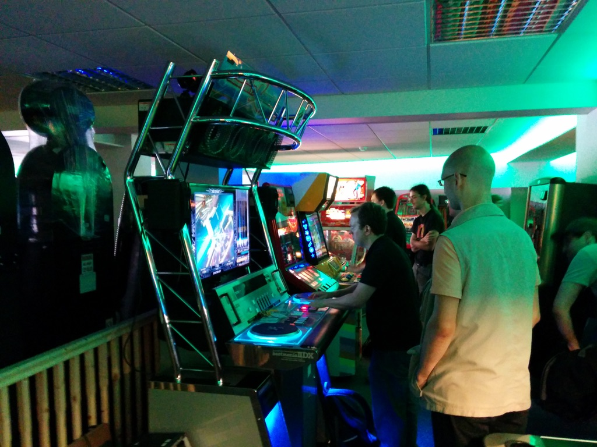
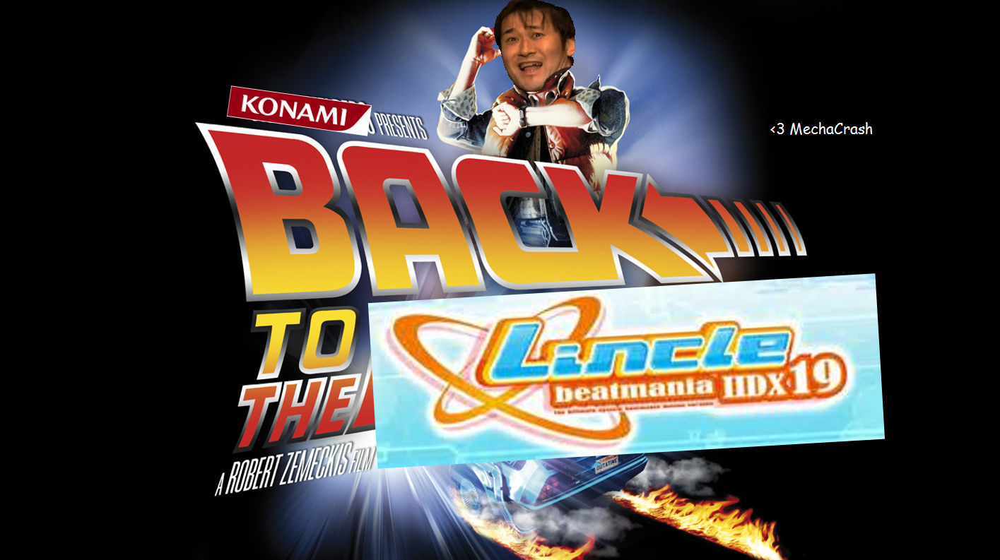
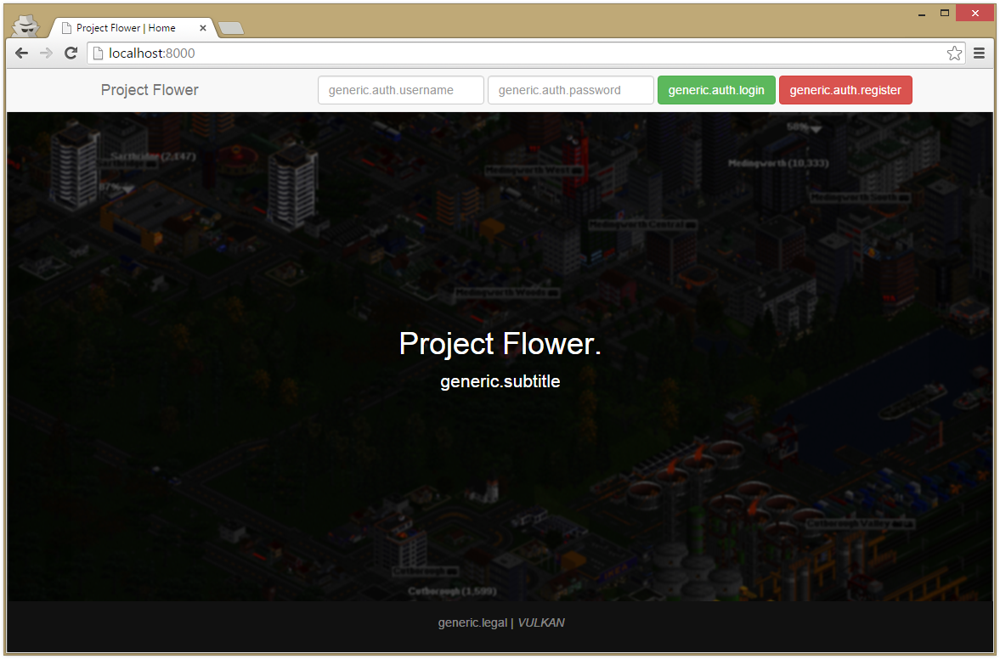
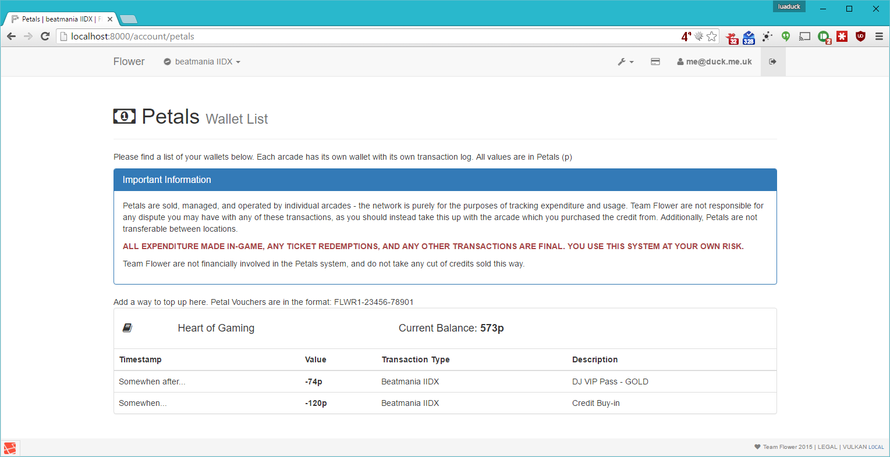
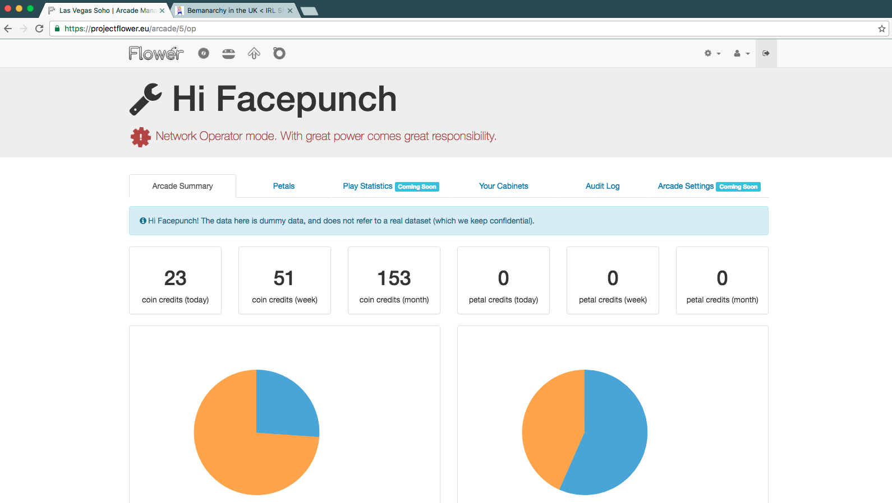
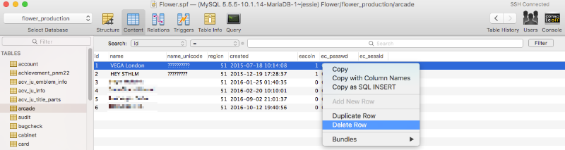

+++
title = "A decade of Flower"
subtitle = "Thoughts on 10 years of The Other Network."
date = "2025-04-30T00:00:00+00:00"
slug = "flower_10"
section_title = "I miss Gwen."
+++

 10 years ago today, at 03:36 AM (UTC+1), I committed the first building blocks of code to _Kailua_, the project that would go on to underpin **Project Flower** (now just _Flower._) - the premier, community-run eAmusement arcade services platform. _Kailua²_ and _Vulkan_ (its web interface) now power countless splinter networks around the world, and to my knowledge is still considered the gold standard re-implementation of the eAmusement protocol. _If you've played on a BEMANI arcade cabinet in the last 10 years and it wasn't in Asia, there's a pretty good chance you interacted with something written by Project Flower, and even more terrifyingly, me_.

And whilst I'm no longer the project lead there - indeed, I left in 2018 for a multitude of reasons, after 3 years - little did I know that commit at an unholy hour of the morning would be the start of a journey that has inarguably touched the lives of thousands, and changed the course of my life immeasurably.

To mark the occasion, please enjoy these rambling memories from my time leading the project. This is based on my best memory of knowledge of how this all went down over a decade ago, so I might be wrong on some elements - please feel free to reach out if you have more information to share or if I'm cataclysmically wrong about something. Bits are intentionally omitted - bits are unintentionally omitted. It's simply a retelling of the story.

Discussion here will intentionally **not** be deeply technical in nature - I will not talk about the details of how the protocol works. The eternally curious can probably find more through their favourite search engine nowadays.

This also will not be a comment about the health of any communities, be that UK, European, or American - whilst I'll touch on bits of it and how they were at the time, it's not my place anymore to say what things are like nowadays. Many people have left (including some particularly toxic ones), many fresh faces have arrived.

___
> [!IMPORTANT]
> Disclaimer: The views expressed herein are my own and are not endorsed by any other party, including Team Flower.
___

## End of the Programmed Era

I got into BEMANI thanks to a random Facepuncher (hi turke!) randomly streaming some PS2 _IIDX16 Empress_ on a PS2 ASC in the autumn of 2013. At the time, I had absolutely no experience with rhythm games - but the challenge looked promising (even if they were only playing 5's and 6's!), so I looked into the community a bit more - acquired a controller at the start of 2014, got set up with the essentials, you know.

As a matter of sheer coincidence, the UK community was looking into acquiring its first IIDX cabinet, to be located at Astro City, in Southend-on-Sea. It arrived in July 2014, and on the 2nd of August they had a free-play weekend - so I took the trip over there to have a play. This was my first time really spending time at an arcade - and the community was great; super welcoming, very newbie friendly. (Shoutouts at this point to Josh, Iman, and so many others - you all know who you are! (and definitely _not_ shoutouts to the terrifying number of people who have been cancelled since then))

I was curious how the card data saving system worked, so asked around. At this point in time, services were provided by _Programmed World_, a worldwide alternative server implementation that had been running for around 3-4 years, providing network service and arcade data on a N-1 basis (that is, one version older than the Japanese version).

For a bit of context, most Japanese arcade games by this point in time required an online connection to boot, authenticate, and synchronise player data. This renders them effectively inert outside of Japan, leaving the worldwide community with absolutely no ability to use these cabinets - short of downgrading to the last versions that did have an offline toggle in their menu (but even then they would be seriously nerfed without the ability to save data - some features and functionality absolutely requires the ability to persist your data between sessions).

Fast forward a few months. In March 2015, _Programmed World_, alongside _Astro City_ and a handful of other arcades receive _Cease & Desist_ notices against both the network, and against the games that were running on the cabinets. A few days later, _Programmed World_ shuts down, and all arcades revert all of their games to the last versions that ran offline.

The reasons and timing of this continue to be debated to this day. There are some camps that believe that the expansion of _Round 1_ (a major chain of Japanese arcades) to the USA forced the hand of the lawyers. There are others that think there were major plans for a huge, world-wide expansion of BEMANI and the eAmusement system to the entire world, leaving an official, blessed path for arcades to use these games. Others still say it was down to the fact that _Programmed World_ were modding the games with extra English patching (they used to be notoriously difficult to understand without either a lot of practice or JLPT5 language proficiency) way before the games had it officially. My personal belief is that it was a mixture of all of the above - there were arcades extremely close geographically to _Round 1_ locations running on _PWorld_, there were a few test cabinets in other countries (including a DDR A in the UK) which fizzled into nothing, and modding the games made it incredibly obvious at the time that they were running unofficially.

The Arcade scene fizzles for around a month. Footfall plummets - why go to an arcade to play an extremely out of date version of a game, with no ability to save progress (when even the PS2 mixes had that)? Without the knowledge that PWorld had built on how the protocol worked, there was no prospect of anyone starting a succeeding network. It was known that it was XML, but it used some horrendous binary obfuscation layer over the top.

And then I stumble upon something that makes me realise that it might be possible after all.

## I Have No Idea What I'm Doing (but this random repo does)

At this point in my life, I had very little experience building software. I had a few tiny little pet projects written in _horrific_ PHP, including some for the _Reddit OpenTTD network_ (which I still contribute to the codebase of occasionally!), but my main _modus operandi_ was as a server administrator / operator. I had an interest in helping build some kind of major platform at some point, but not necessarily in the arcade sphere.

This didn't stop me from being curious about fiddling with it, so I start doing some research. And I stumble upon a random repository on a personal Gitlab by this random user called **@yugge** - a basic server written in _Go_ that can, if a game is pointed to it, provide just enough response to it to get it running. Complete with the magic bits of binary encoding, compression, and encryption routines.

My jaw dropped. Here it was - the proof it could be figured out, the proof that the magic could be turned into the decipherable.

I quickly get chatting to a couple of way more talented friends (I remember one specific conversation over KFC at a shopping centre), and then reach out to @yugge to see if he was interested in building it out with us.

This was the litmus moment that, arguably, marked the founding of the project. We chose the name _Project Flower_ - a project to get _[Flower](https://www.youtube.com/watch?v=VDSxWxnumKM)_ (by far the most overplayed, over-franchised song - you could play it on literally every BEMANI game) heard once more in the arcades of Europe.

The project was founded with:
* myself as the lead / network operator
* @yugge, contributing development time
* one close friend / Facepuncher who I won't name unless they want to be (who contributed a transliteration of the magic bits)
* the owner of the UK cabinets, who does not deserve to be named (went on to hostile-splinter the project and turn the UK community against us)
* one other person, who I will not name for personal reasons

alongside the support of a couple of other community friends providing non-technical support / arcade liaison, as well as an **extraordinarily** talented reverse engineer from California (she knows who she is!)

We agreed a few core pillars before starting:

* we would make absolutely no income or profit off of the network
* whilst we would not share the specific details on how everything worked (which unfortunately meant being closed source to start), we would be as open and transparent about development as possible with the community
* we would only provide service to Europe (this has expanded since to countries with no foreseeable pathway to official service)
* we would only provide service to cabinets that were as close to 100% legitimate as possible, to avoid random hack-jobs / laptops plugged in to controllers
* we would not get involved in the business of distributing the actual game data to arcades - that was on them

Our consensus was that by following these self-imposed rules, we would keep the network relatively small, quiet, and off the radar. We had no interest in picking fights, making money, or attracting unwanted attention - just in getting these games running to get the community back into arcades, socialising, having fun.

At the time, I had no experience with _Go_, which was still a relatively young language at the time - so we took the decision to transliterate everything into _Python 2_ (note: this was a stupid mistake, Python 3 was out at the time and we should've just gone with that) as a mutually simple language that everyone could at the very least read. I still had a pretty major learning curve - my bare basic PHP knowledge got me some of the way, but I found Python super easy to pick up and start building with - even if I spent most of my time in the debugger.

The first commit was **today, 10 years ago, at 03:36 in the morning.** The UK had one of its quarterly meetups at Astro City on the 22nd of May. So I wondered - was it possible to have an initial prototype ready for then?

3 weeks of hard graft followed. Pretty much 70/80% of my nights were all-night code bashing marathons, fuelled entirely by cola and a weapons-grade quantity of _[Denpa](https://en.wikipedia.org/wiki/Denpa_song)_. I had two PC's running - one with a copy of IIDX running on a Windows XP machine, another with my Windows 7 install and a copy of Visual Basic (I'd later move over to MacOS and PyCharm / PHPStorm). They were connected through a random HP 10/100 enterprise switch I picked up for £5 a few months prior which I was using as a port mirror into Wireshark on my development machine for debugging.

And I'm not quite sure how I managed it, but somehow, with everyone's support, we had a very rudimentary implementation of _Kailua_ ready to go for the meetup. And we surprised the whole community with it.

## The Rise of The Other Network

")

(Indulge my technical talk for a moment - the '50' bug referred to above turned out to be a monumentally silly issue caused by games parsing the attribute keys of an XML node in alphabetical order, but the values in chronological - sending non-alphabetically sorted attributes causes things to get put in the wrong pots. This was particularly an issue on Python 2, where dictionaries were not guaranteed to be returned in the same sorted order (you needed an `OrderedDict` for that). This was the kind of thing that was a daily occurrence on the project.)

Location Test 1 was a roaring success. Whilst we only had the bare minimum bits and pieces working for IIDX, it was still a miracle - and a major breakthrough to accomplish something widely thought immensely challenging - if not impossible - for amateurs to achieve.

Development continued apace over the next 3 months. Basically every other weekend involved me taking the ~4h trip over to _Astro City_ for more testing and socialising, and every week I'd be throwing everything I had into Visual Studio to build out the rest of the functionality needed to go live. There were two more Location Tests, the second testing pop'n support and the third with DDR and full IIDX. 

The last month or so was spent on getting _Vulkan_, the Web UI, up and running. I've dug out some old archive screenshots, including some which have never been seen publicly before:

... _as an aside, have you ever stopped and stared at the pop'n logo in the menu bar for more than 30 seconds?_

We made the decision as an arcade (and a development team) to go permanently live at the conclusion of Test 3, which was on the 30th September 2015.

The community reaction to going live was mixed. There were some that viewed this as poking the beast of the dragon - I recall one conversation in particular with one well known figure saying that what we were intending on doing endangered the entire rhythm community (probably a good thing we ignored that). There were others in the opposite direction saying that we weren't going far enough and needed to be providing game updates to give people a reason to go into arcades in the first place - which went against our agreed golden rules. We ended up sticking to our internal promises.

By the end of the year, with the addition of HEY STHLM, 2 European arcades were live on Flower. By the end of 2016, there were 6. 10 years later, there are **at least 200**.

## Controversial Times & Controversial Measures

2016 was easily one of the most challenging years for the project. The owner of the cabinets at _Astro City_ (who by this point had moved to a new location in central London, _Vega_) was a talented PHP developer who we brought in to work on the project at a relatively early stage as a helpful set of hands for the web interface (**I am intentionally not going to name a name here**) - indeed, his presence was one of the main reasons we chose the language for Vulkan in the first place. He held his views quite firmly that he disagreed with building Kailua in Python, saying PHP would have been a much better choice as it was something he could contribute more heavily to.

There was also community dissatisfaction over our stance on unlocking songs. The policy at the time was that songs would be unlocked in the usual fashion, through gameplay - although we would speed up the necessary grind however we could. This was for three reasons: to try to bring the network into as much parity with the original as possible, encourage repeat visits to arcades, and because we were unhappy with how certain parts of the game reacted to having everything be forcibly unlocked.

**In hindsight, this was a mistake.** If I could rewind and change how I approached handling the project differently, I absolutely, 100% would have listened more closely to what the community was asking for. We eventually pivoted our position to be "locked by default, but tick a box in the Web UI to experimentally unlock everything at your own risk", but amid this annoyance, things were brewing behind our backs.

The PHP developer I mention above was closely aligned with a number of the rhythm scene's highest echelons - including one recently disgraced figure in particular who many will know as _Corin_. Corin by this point was rapidly consolidating power and administrative control in a number of scene elements, including _remywiki_ and other community sites. There were already murmorings in the scene that he wasn't a fit person to be taking control of so much stuff, but nonetheless he held a position of considerable strength. I counted myself in that circle of influence for some time - private chats, VIP access to forums, you know the drill. But there was an air of disillusionment.

In the middle of 2016 (I don't have the exact date), I woke up to find most all of my status removed, the _Vega_ arcade offline on Flower, and a lot of confused messages. The PHP developer mentioned above had been secretly working with the Flower codebase for a number of months on a splinter network with Corin and others, and decided to start their own network up without any of our knowledge or blessing.

My personal view is that certain people didn't have enough of a spine to stand up against Corin at this moment. Perhaps this is unfair of me; perhaps this is an understatement.

I don't think I need to explain how much of a shock this was to the entire committed team of developers we had. The defection (and theft of our work) felt like a knife to our collective backs.

I instinctively pushed for the project to immediately be open sourced in protest, but was talked down by the rest of the development team (quite fairly). Instead, I did something far more inert, which was to release one of the unmodified, coin-hot DLLs publicly (game binaries are (were?) usually circulated in the community with the "coin" line non-functional to avoid arcades making money on them, even though patching this back in was trivial). This got me banned from basically everything - but to be honest, that was kind of the intention.

By this point, I'd had enough of the community's insatiable lust for drama. It seemed like every week, the UK community in particular was looking for some new reason to cause a fuss or some new bandwagon against someone. _Corin_ and his team of drama starters were absolutely the main reason for this. I was dumb to continue to get close to them, and I continue to regret being so involved to this day - and I can only apologise to everyone that got caught up in it (please let me know and I'll buy you a drink if you like). I realised that I just wanted to work on and play rhythm games with people I was proud to call my friends, and enable healthy communities to flourish - not get tied up in drama every 5 minutes.

So I did.

## The End of My Run

I continued to work on Kailua and Vulkan over the next couple of years, including a full Python 3 rewrite of Kailua creatively known as Kailua² - which was desperately needed, as the codebase resembled spaghetti so strongly that you probably could have lived off of it for a month. There were a huge number of improvements driven into it, including modularity (with the intention of one day open sourcing select elements) and API support. Kailua² launched on the 13th of August 2018, with some teething issues which were quickly resolved thanks to _Team Flower_.

I had been struggling for some time with my own health, both physically and mentally. My father suffered a heart attack that I witnessed at the end of 2015, and that combined with the stress of the above drama contributed to a personal mental health crisis through 2017, which meant I wasn't able to put anywhere near as much into _Flower_ as I wanted to.

I took the decision to resign my role as project leader at the same time K² launched a few months before, in a post to the internal team channel.

> ...
>
> So here's the deal. I am ceasing active development, effective today. I _need_ everyone able to contribute to pitch in to get this thing done, as soon as humanly possible (for my own selfish sake).
> The only work I am prepared to do is the stuff that absolutely, without alternative, 100% requires me
>(such as the code freeze / review, final deployment, maybe providing some architecture guidance if you need help with it, and maybe bits of ChartID / similar bugfixes if that requires my attention).
>
> ...
>
> If I was a saner person, I would just drop everything and take the time I need as soon as possible. But the reality is twofold: I want to make this baby of ours a reality for our users, and I want to hand this off to all of you in the healthiest state possible (because, honestly, you all mean way, way too much to me to do otherwise). 
>
> I'm so sorry to have to ask for this one last push from all of you; but I hope that by being honest with you about my current state, I can attempt to repay the last year of me not living up to my responsibilities.

And I've missed working on the project since, even if my personal health hasn't been up to it.

---

## Since 2018...

I continued to keep close friendships up with a number of community members for years ahead (and I stupidly got in a relationship with one for a few years (don't ask how that went)).

_Corin_ was forcibly removed from the scene (and apparently from his job) at the beginning of 2023 after credible reports of sexual assault that occurred during my time in the community, including by one player in particular who was **incredibly** brave in stepping forward. I was utterly abhored when they came to light, and I continue to be to this day. I can only apologise that the community wasn't able to stand up to him earlier.

At the beginning of 2020, one of my closest friends from my time working on the project, and Team member _Helvetica / Gwen_, passed away. She is sorely missed by myself, the Ohio arcade scene, and all of _Team Flower_. My heart is still broken. 💔

My mum, who was one of the original voices back at the very start of _Project Flower_ pushing me to push myself and give it a try (and without whose voice it probably would've never happened), passed away last year from cancer, leaving another huge hole in my heart.

And _Flower._ continues to thrive to this day, now operating in over 200 arcades in Europe and around the world, with thousands of registered users. Still powered by Kailua² and Vulkan. Still doing amazing things for an incredible community.

Roll on 20**3**5, hm?

## Would I do it again?

**Maybe.**

---

# You made it to the end?!

Wow, well done for reading the whole thing! (Or pressing Page Down, that also counts.)

 I've had a special run of Flower-themed stickers printed to mark the occasion. They are being dispatched at no cost as we speak to select arcades in the UK, the Netherlands, and Sweden which have been on network the longest, and I have encouraged these locations to share them out with players. Other locations can feel free to reach out to me via the usual channels if they'd like a few.

I will also keep a healthy supply on hand, in case you bump in to me. In particular, I'll be at FreePlayCity in London this Sunday (May 4th) - please come along, share a drink, and reminisce!

Please go and visit your local Flower arcade this weekend - play a credit or two, chat with other players, and enjoy the result of so many passionate people's time and love.